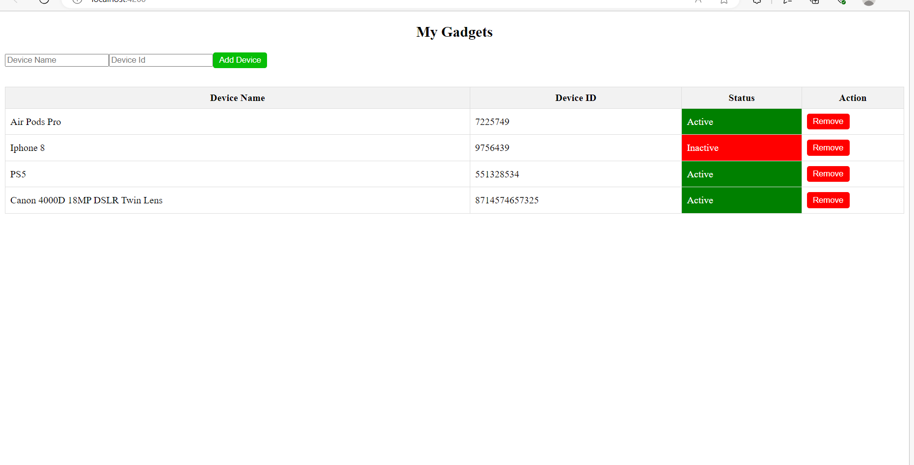

# GadgetManager

GadgetManager is a full-stack application for managing gadgets/devices. It provides a interface for organizing and tracking your collection of gadgets. 

## Technologies Used

### Backend

- Java
- Spring Boot
- Spring Web
- Maven
- MySQL

### Frontend

- Angular

